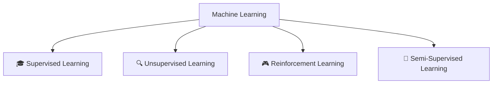

# 🤖 Machine Learning - Complete Guide

<div align="center">


*"The future belongs to those who learn more skills and combine them in creative ways."* — Robert Greene

</div>

---

## 📚 Table of Contents

- [What is Machine Learning?](#-what-is-machine-learning)
- [Types of Machine Learning](#-types-of-machine-learning)
- [Unsupervised Learning Deep Dive](#-unsupervised-learning-deep-dive)
- [Algorithms & Techniques](#-algorithms--techniques)
- [Real-World Applications](#-real-world-applications)
- [Tools & Libraries](#-tools--libraries)
- [Getting Started](#-getting-started)

---

## 🧠 What is Machine Learning?

> **Machine Learning** is a subset of Artificial Intelligence that enables computers to **learn from data** and make decisions without being explicitly programmed.

```
┌─────────────────────────────────────────────────────────────┐
│                   ARTIFICIAL INTELLIGENCE                    │
│  ┌───────────────────────────────────────────────────────┐  │
│  │                  MACHINE LEARNING                      │  │
│  │  ┌─────────────────────────────────────────────────┐  │  │
│  │  │               DEEP LEARNING                      │  │  │
│  │  │  ┌─────────────────────────────────────────┐    │  │  │
│  │  │  │        NEURAL NETWORKS                   │    │  │  │
│  │  │  └─────────────────────────────────────────┘    │  │  │
│  │  └─────────────────────────────────────────────────┘  │  │
│  └───────────────────────────────────────────────────────┘  │
└─────────────────────────────────────────────────────────────┘
```

### 🔑 Key Concepts

| Concept | Description |
|---------|-------------|
| **Training** | The process of teaching a model using data |
| **Features** | Input variables used to make predictions |
| **Labels** | Output variables (target) in supervised learning |
| **Model** | Mathematical representation learned from data |
| **Inference** | Using trained model to make predictions |

---

## 🎯 Types of Machine Learning



### Comparison Table

| Type | Data Type | Goal | Example |
|------|-----------|------|---------|
| 🎓 **Supervised** | Labeled | Predict outcomes | Spam Detection |
| 🔍 **Unsupervised** | Unlabeled | Find patterns | Customer Segmentation |
| 🎮 **Reinforcement** | Feedback-based | Maximize rewards | Game AI |
| 🔄 **Semi-Supervised** | Mixed | Best of both worlds | Image Classification |

---

# 🔍 Unsupervised Learning Deep Dive

<div align="center">

## ✨ *"Finding hidden patterns in data without any guidance"* ✨

</div>

---

## 🎪 What is Unsupervised Learning?

> **Unsupervised Learning** is a type of machine learning where the algorithm learns patterns from **unlabeled data** without any predefined outcomes or supervision.

### 🆚 Supervised vs Unsupervised

```
   SUPERVISED LEARNING                    UNSUPERVISED LEARNING
   ══════════════════                     ═════════════════════
   
   📊 Input Data                          📊 Input Data
        │                                      │
        ▼                                      ▼
   🏷️ Labels/Targets                      ❌ No Labels
        │                                      │
        ▼                                      ▼
   🎯 Learn Mapping                       🔍 Find Patterns
        │                                      │
        ▼                                      ▼
   📈 Predict New Data                    📊 Group/Reduce Data
```

### 💡 Key Characteristics

- ✅ Works with **unlabeled data**
- ✅ Discovers **hidden patterns**
- ✅ **No predefined** correct answers
- ✅ Great for **exploratory analysis**
- ✅ Finds **natural groupings**

---

## 🛠️ Algorithms & Techniques

### 1️⃣ Clustering Algorithms

> **Goal:** Group similar data points together

#### 📌 K-Means Clustering

```python
from sklearn.cluster import KMeans

# Create KMeans model
kmeans = KMeans(n_clusters=3, random_state=42)
kmeans.fit(data)

# Get cluster labels
labels = kmeans.labels_
```

**How it works:**
```
Step 1: Choose K (number of clusters)
    🎯 → 🎯 → 🎯  (3 random centroids)
    
Step 2: Assign points to nearest centroid
    ⚫⚫⚫ → 🔴  
    ⚫⚫   → 🔵  
    ⚫⚫⚫⚫ → 🟢  
    
Step 3: Update centroids
    🔴 moves to center of its points
    
Step 4: Repeat until convergence ✓
```

| Pros ✅ | Cons ❌ |
|---------|---------|
| Simple & Fast | Must specify K |
| Scales well | Sensitive to outliers |
| Easy to interpret | Assumes spherical clusters |

---

#### 📌 Hierarchical Clustering

```python
from sklearn.cluster import AgglomerativeClustering

# Agglomerative (bottom-up) clustering
hc = AgglomerativeClustering(n_clusters=3)
labels = hc.fit_predict(data)
```

**Dendrogram Visualization:**
```
                    ┌───────────────────┐
                    │                   │
            ┌───────┴───────┐           │
            │               │           │
        ┌───┴───┐       ┌───┴───┐   ┌───┴───┐
        │       │       │       │   │       │
       [A]     [B]     [C]     [D] [E]     [F]
```

---

#### 📌 DBSCAN (Density-Based Clustering)

```python
from sklearn.cluster import DBSCAN

# DBSCAN clustering
dbscan = DBSCAN(eps=0.5, min_samples=5)
labels = dbscan.fit_predict(data)
```

**Perfect for:**
- 🌀 Irregular shaped clusters
- 🚫 Automatic outlier detection
- ❓ Unknown number of clusters

---

### 2️⃣ Dimensionality Reduction

> **Goal:** Reduce the number of features while preserving information

#### 📌 Principal Component Analysis (PCA)

```python
from sklearn.decomposition import PCA

# Reduce to 2 dimensions
pca = PCA(n_components=2)
reduced_data = pca.fit_transform(data)
```

```
    HIGH DIMENSIONAL DATA          →         REDUCED DATA
    ════════════════════                     ═════════════
    
    Feature 1 ─┐                             
    Feature 2 ─┤                             Component 1 ─┐
    Feature 3 ─┼──→  PCA  ──→               Component 2 ─┘
    Feature 4 ─┤                             
    Feature 5 ─┘                             (95% variance kept!)
```

---

#### 📌 t-SNE (t-Distributed Stochastic Neighbor Embedding)

```python
from sklearn.manifold import TSNE

# t-SNE for visualization
tsne = TSNE(n_components=2, perplexity=30)
reduced_data = tsne.fit_transform(data)
```

**Best for:** 📊 Visualizing high-dimensional data in 2D/3D

---

### 3️⃣ Association Rule Learning

> **Goal:** Find interesting relationships between variables

#### 📌 Apriori Algorithm

```
    🛒 Market Basket Analysis
    ═══════════════════════
    
    IF customer buys 🍞 Bread + 🧈 Butter
    THEN likely to buy 🥛 Milk
    
    Confidence: 85%
    Support: 45%
```

**Key Metrics:**
| Metric | Formula | Meaning |
|--------|---------|---------|
| **Support** | P(A ∩ B) | How frequently items appear together |
| **Confidence** | P(B\|A) | How often the rule is true |
| **Lift** | Confidence / P(B) | Strength of association |

---

### 4️⃣ Anomaly Detection

> **Goal:** Identify unusual patterns or outliers

```python
from sklearn.ensemble import IsolationForest

# Detect anomalies
iso_forest = IsolationForest(contamination=0.1)
predictions = iso_forest.fit_predict(data)
# -1 = anomaly, 1 = normal
```

**Use Cases:**
- 💳 Fraud Detection
- 🔐 Cybersecurity
- 🏭 Manufacturing Defects
- 📊 Data Quality

---

## 🌍 Real-World Applications

<div align="center">

| Domain | Application | Algorithm |
|--------|-------------|-----------|
| 🛍️ **Retail** | Customer Segmentation | K-Means |
| 🎬 **Entertainment** | Recommendation Systems | Collaborative Filtering |
| 💳 **Finance** | Fraud Detection | Isolation Forest |
| 🏥 **Healthcare** | Disease Clustering | Hierarchical |
| 📱 **Social Media** | Topic Modeling | LDA |
| 🖼️ **Computer Vision** | Image Compression | PCA |
| 📰 **News** | Document Clustering | K-Means |
| 🎵 **Music** | Playlist Generation | DBSCAN |

</div>

### 📊 Industry Impact

```
┌─────────────────────────────────────────────────────────────┐
│                    BUSINESS APPLICATIONS                     │
├─────────────────────────────────────────────────────────────┤
│                                                              │
│   👥 Customer Segmentation                                   │
│   ├── Marketing Campaigns                                    │
│   ├── Personalized Offers                                    │
│   └── Customer Lifetime Value                                │
│                                                              │
│   📈 Market Analysis                                         │
│   ├── Trend Detection                                        │
│   ├── Competitive Analysis                                   │
│   └── Price Optimization                                     │
│                                                              │
│   🔒 Security                                                │
│   ├── Intrusion Detection                                    │
│   ├── Network Anomalies                                      │
│   └── Behavioral Analysis                                    │
│                                                              │
└─────────────────────────────────────────────────────────────┘
```

---

## 🧰 Tools & Libraries

### Python Libraries

```python
# Essential imports for Unsupervised Learning
import numpy as np                    # Numerical computing
import pandas as pd                   # Data manipulation
import matplotlib.pyplot as plt       # Visualization
import seaborn as sns                 # Statistical visualization

# Scikit-learn (most popular)
from sklearn.cluster import KMeans, DBSCAN, AgglomerativeClustering
from sklearn.decomposition import PCA, NMF
from sklearn.manifold import TSNE
from sklearn.preprocessing import StandardScaler
```

### 📦 Library Comparison

| Library | Best For | Difficulty |
|---------|----------|------------|
| **Scikit-learn** | General ML | ⭐ Easy |
| **TensorFlow** | Deep Learning | ⭐⭐⭐ Hard |
| **PyTorch** | Research | ⭐⭐⭐ Hard |
| **NLTK** | Text Analysis | ⭐⭐ Medium |
| **OpenCV** | Computer Vision | ⭐⭐ Medium |

---

## 🚀 Getting Started

### Step-by-Step Workflow

```
   📊 DATA COLLECTION
          │
          ▼
   🧹 DATA PREPROCESSING
          │
    ┌─────┴─────┐
    ▼           ▼
 Cleaning   Scaling
    │           │
    └─────┬─────┘
          ▼
   🔬 EXPLORATORY ANALYSIS
          │
          ▼
   🤖 MODEL SELECTION
          │
          ▼
   ⚙️ TRAINING
          │
          ▼
   📈 EVALUATION
          │
          ▼
   🎯 INTERPRETATION
```

### 💻 Quick Start Code

```python
# Complete Unsupervised Learning Pipeline

import numpy as np
import pandas as pd
from sklearn.preprocessing import StandardScaler
from sklearn.cluster import KMeans
from sklearn.decomposition import PCA
import matplotlib.pyplot as plt

# 1. Load Data
data = pd.read_csv('your_data.csv')

# 2. Preprocess
scaler = StandardScaler()
scaled_data = scaler.fit_transform(data)

# 3. Dimensionality Reduction (optional)
pca = PCA(n_components=2)
reduced_data = pca.fit_transform(scaled_data)

# 4. Clustering
kmeans = KMeans(n_clusters=3, random_state=42)
clusters = kmeans.fit_predict(reduced_data)

# 5. Visualize
plt.figure(figsize=(10, 6))
plt.scatter(reduced_data[:, 0], reduced_data[:, 1], 
            c=clusters, cmap='viridis')
plt.xlabel('Principal Component 1')
plt.ylabel('Principal Component 2')
plt.title('K-Means Clustering Results')
plt.colorbar(label='Cluster')
plt.show()
```

---

## 📊 Evaluation Metrics

> Since there are no labels, evaluation is tricky!

| Metric | Description | Range |
|--------|-------------|-------|
| **Silhouette Score** | Measures cluster separation | -1 to 1 (higher = better) |
| **Calinski-Harabasz** | Ratio of between/within cluster dispersion | Higher = better |
| **Davies-Bouldin** | Average similarity between clusters | Lower = better |
| **Inertia** | Sum of squared distances to centroids | Lower = better |

```python
from sklearn.metrics import silhouette_score

# Calculate silhouette score
score = silhouette_score(data, labels)
print(f"Silhouette Score: {score:.3f}")
```

---

## 🎓 Best Practices

### ✅ Do's

- 📏 **Always scale your data** before clustering
- 🔍 **Visualize data** before choosing algorithm
- 🧪 **Experiment** with different algorithms
- 📊 **Use multiple metrics** for evaluation
- 🔄 **Iterate** and refine your approach

### ❌ Don'ts

- ⚠️ Don't assume clusters are spherical
- ⚠️ Don't ignore outliers without analysis
- ⚠️ Don't use too many or too few clusters
- ⚠️ Don't forget to preprocess data
- ⚠️ Don't interpret results without domain knowledge

---

## 📚 Resources

### 📖 Books
- *"Pattern Recognition and Machine Learning"* - Christopher Bishop
- *"The Elements of Statistical Learning"* - Hastie, Tibshirani, Friedman
- *"Hands-On Machine Learning"* - Aurélien Géron

### 🎥 Online Courses
- [Coursera - Machine Learning by Andrew Ng](https://coursera.org)
- [Fast.ai - Practical Deep Learning](https://fast.ai)
- [Kaggle Learn](https://kaggle.com/learn)

### 🔗 Useful Links
- [Scikit-learn Documentation](https://scikit-learn.org/)
- [Towards Data Science](https://towardsdatascience.com/)
- [Machine Learning Mastery](https://machinelearningmastery.com/)

---

<div align="center">

## 🌟 Summary

| Aspect | Details |
|--------|---------|
| **What** | Learning from unlabeled data |
| **Why** | Find hidden patterns & structures |
| **When** | No labels available / Exploratory analysis |
| **How** | Clustering, Dimensionality Reduction, Association Rules |
| **Tools** | Scikit-learn, TensorFlow, PyTorch |

---

### 💡 Remember

*"In unsupervised learning, we're not trying to predict an outcome — we're trying to discover the underlying structure of our data."*

---

**Made with ❤️ for Machine Learning Enthusiasts**

[](https://python.org)
[](https://scikit-learn.org)
[](https://jupyter.org)

</div>

---

<div align="center">

**⭐ Star this repo if you found it helpful! ⭐**

</div>
